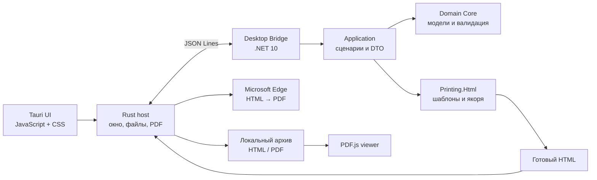

<p align="center">
  
</p>

<h1 align="center">MADOC</h1>

<p align="center">
  <strong>Настольный конструктор документов с валидацией, HTML/PDF-генерацией и локальным архивом</strong>
</p>

<p align="center">
  <a href="https://dotnet.microsoft.com/"></a>
  <a href="https://tauri.app/"></a>
  <a href="https://www.rust-lang.org/"></a>
  <a href="https://www.microsoft.com/windows/"></a>
</p>

---

MADOC помогает заполнять типовые формы, проверять данные до создания документа и сохранять готовый результат в HTML или PDF. Приложение работает в нативном окне Windows, формирует документы локально.

## Возможности

- Динамические формы на основе доменных моделей и атрибутов валидации.
- Зависимые списки и автоматическая фильтрация доступных значений.
- Предпросмотр печатной формы до сохранения.
- Создание документов в форматах **PDF** и **HTML**.
- Кастомный PDF-просмотрщик на базе локального PDF.js:
- Локальный архив с поиском и фильтрами.
- Self-contained Desktop Bridge — установленному приложению не требуется отдельный .NET Runtime.

## Доступные документы

| Документ | Ключ шаблона |
|---|---|
| Заявка на справку | `certificate_request` |
| Заявление студента | `student_application` |
| Договор оказания услуг | `service_contract` |
| Заявка на командировку | `business_trip_request` |
| Заявка на бронирование аудитории | `room_booking_request` |

## Архитектура



| Проект | Ответственность |
|---|---|
| `MADOC.Domain.Core` | Документы, ограничения, списки и зависимости полей |
| `MADOC.Printing.Html` | Печатные якоря и подстановка данных в HTML |
| `MADOC.Application` | Формы, валидация и сценарий генерации документа |
| `MADOC.DesktopBridge` | JSONL-интерфейс между frontend и .NET |
| `MADOC.Tauri` | Desktop UI, файловое хранилище, PDF и упаковка приложения |
| `*.Tests` | Модульные и интеграционные тесты |

## Требования для разработки

- Windows x64.
- [.NET SDK 10](https://dotnet.microsoft.com/).
- Node.js и npm.
- Rust stable с MSVC toolchain.
- Microsoft C++ Build Tools, необходимые для Tauri.
- Microsoft Edge — используется для локального преобразования HTML в PDF.

## Быстрый старт

```powershell
git clone https://github.com/bubus1kk/MADOC.git
cd MADOC

dotnet restore MADOC.slnx

cd MADOC.Tauri
npm install
npm run dev
```

## Сборка установщика

```powershell
cd MADOC.Tauri
npm install
npm run build
```

## Тесты

```powershell
dotnet restore MADOC.slnx
dotnet test MADOC.slnx
```

Тестовые проекты покрывают доменные ограничения, зависимости списков, HTML-якоря, генерацию печатных форм и протокол Desktop Bridge.


## Хранение документов

Готовые файлы сохраняются в:

```text
%USERPROFILE%\Documents\MADOC\Печатные формы
```

Служебный индекс архива находится отдельно:

```text
%APPDATA%\ru.madoc.desktop.concept\print-form-index
```


## Как добавить новый тип документа

1. Создать модель документа в `MADOC.Domain.Core/Documents`.
2. Добавить ограничения и конфигурации зависимых списков.
3. Зарегистрировать тип в `DocumentTypeRegistry`.
4. Добавить HTML-шаблон и CSS в `MADOC.Application/Printing`.
5. Покрыть модель, валидацию и генерацию тестами.

Шаблоны используют печатные якоря вида:

```html
<span>{{ doc:certificate_request.full_name }}</span>
```

Во время генерации MADOC подставляет значения модели, форматирует даты, диапазоны, списки и вычисляемые поля.
